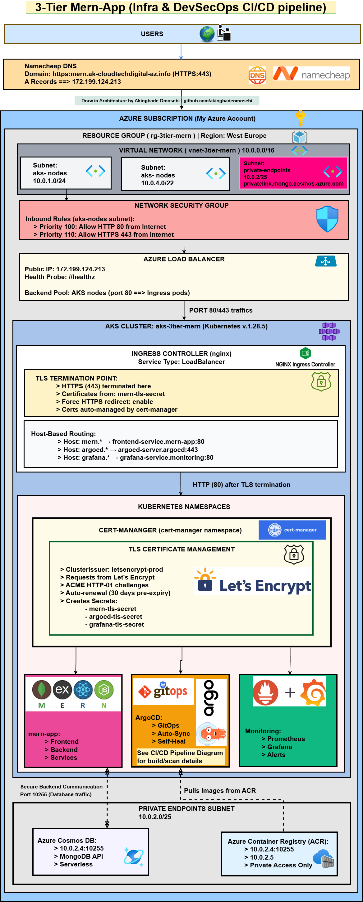
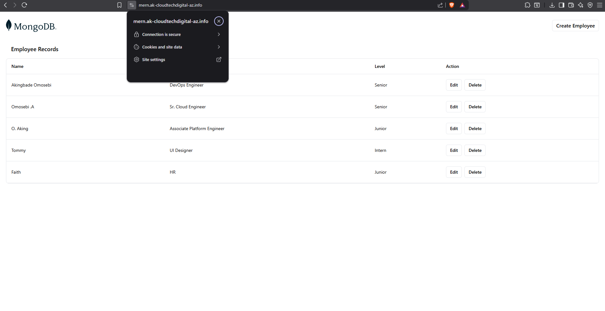
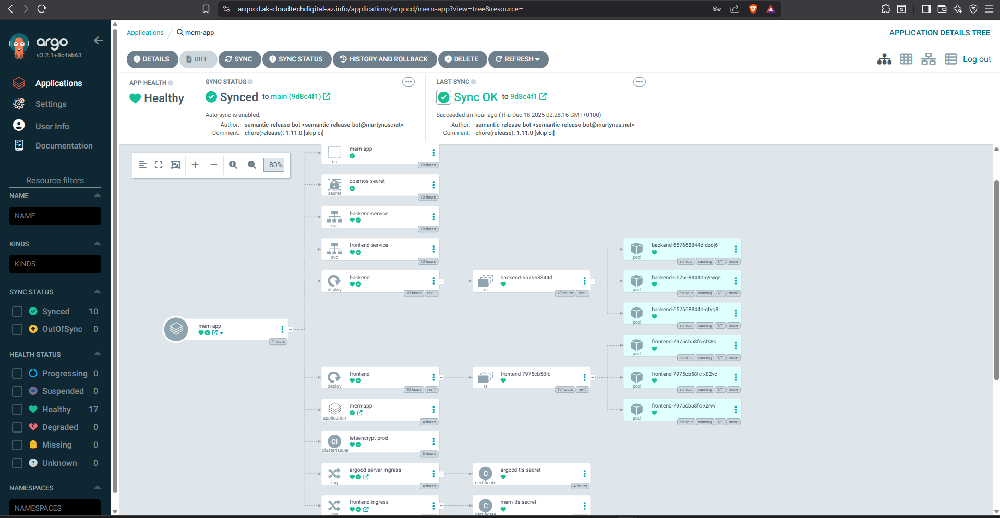
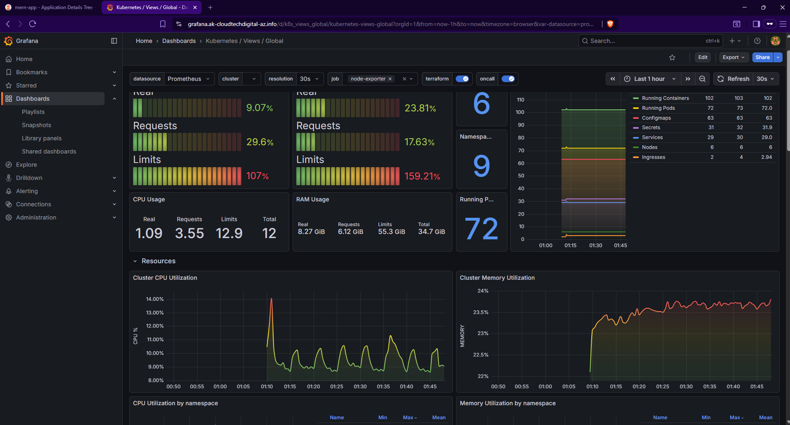
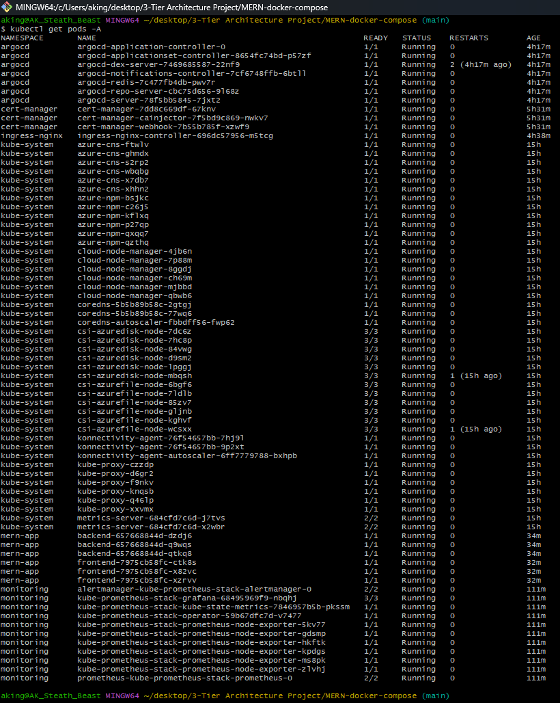
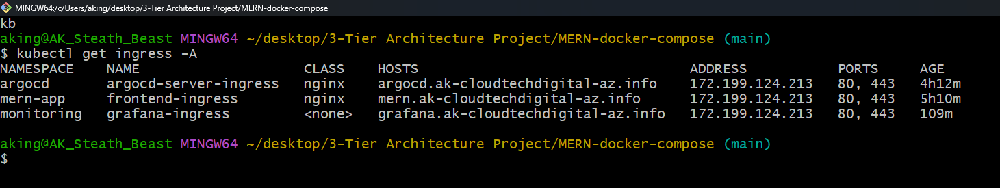
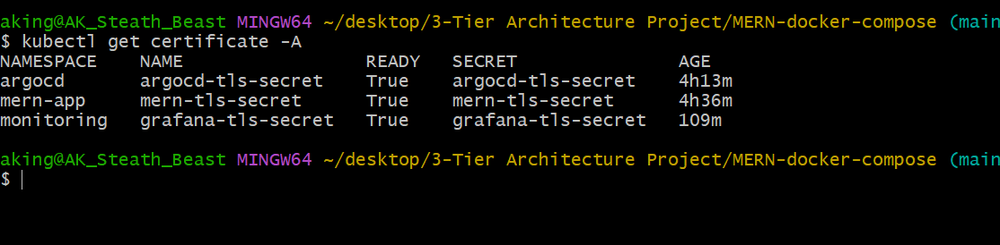
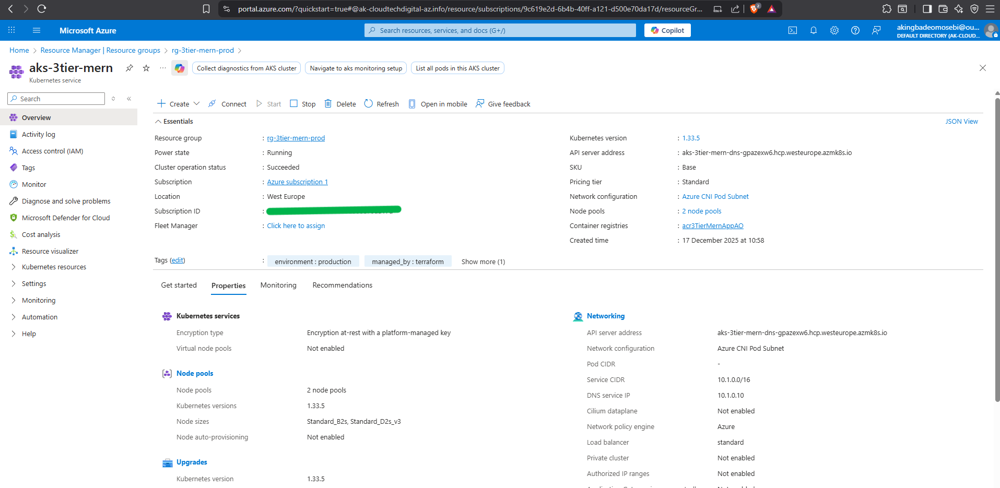
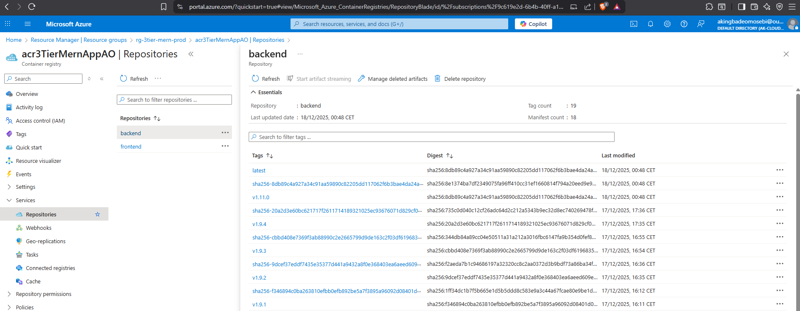
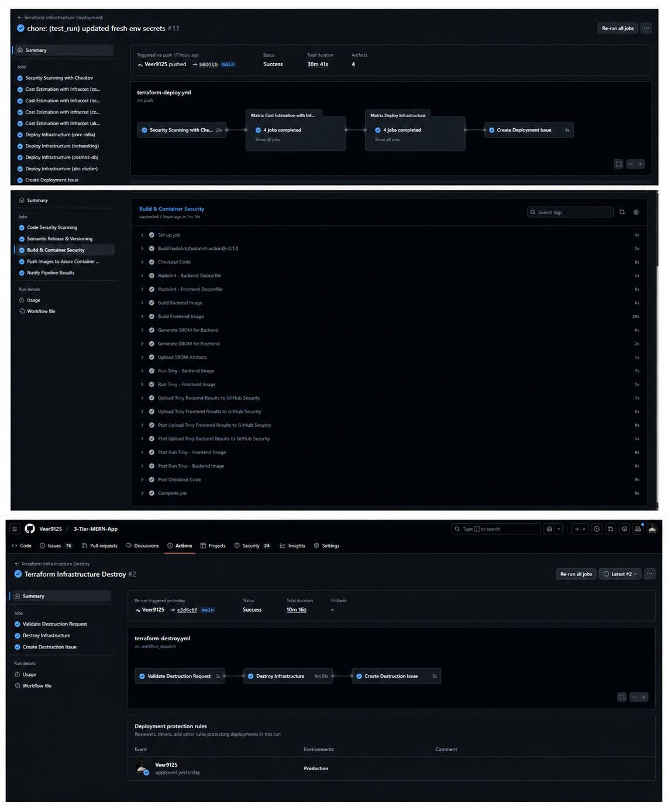

# Azure MERN Secure Dilevery Pipeline: Production AKS Platform with DevSecOps Pipeline & GitOps

A complete cloud-native platform demonstrating enterprise DevSecOps practices, GitOps workflows, and comprehensive observability - from infrastructure provisioning through production deployment.


**Deployment Status:** Previously deployed to production at 
`mern.ak-cloudtechdigital-az.info` with automated TLS certificates. 
Infrastructure destroyed to save costs after project completion.

**Evidence of Production Deployment:**
- ✅ 23 production screenshots ([view all](docs/SCREENSHOT_GUIDE.md))
- ✅ DNS configuration ([screenshot](docs/images/18-DNS-Config-NamesCheap.png))
- ✅ TLS certificates ([screenshot](docs/images/17-tls-certificate.png))
- ✅ GitHub Actions deployment logs (workflow history)
- ✅ 2 architecture diagrams ([deployment](docs/images/3-Tier-Mern-App-Architecture-Deployment.drawio.png))


---

## What I Built

I took a containerized MERN application and built a production-ready platform around it, implementing everything a modern SaaS company needs:

- **Automated Infrastructure**: Terraform provisions everything from networking to Kubernetes clusters
- **Zero-Downtime Deployments**: ArgoCD GitOps with automatic sync and self-healing
- **Security-First Pipeline**: 8 security scanning layers catch vulnerabilities before production
- **Full Observability**: Prometheus and Grafana provide complete visibility into application and infrastructure health
- **Automatic TLS**: cert-manager handles certificate lifecycle with Let's Encrypt

This project represents the kind of platform engineering work I want to do professionally - building the infrastructure that lets development teams move fast while maintaining reliability and security.

---

## Architecture Overview

```
User Browser
    │
    ▼
Namecheap DNS (mern.ak-cloudtechdigital-az.info → 172.199.124.213)
    │
    ▼
Internet (HTTPS)
    │
    ▼
Azure Load Balancer (NSG Protected)
    │
    ▼
nginx Ingress Controller (TLS Termination)
    │
    ├─► Frontend (React + nginx) ──┐
    │                               │
    └─► Backend (Node.js + Express) ┼─► Azure Cosmos DB
                                    │   (MongoDB API)
                                    │
                                    └─► Monitored by Prometheus
                                        Visualized in Grafana
                                        Managed by ArgoCD
```
### Infrastructure & Network Topology (Deep Dive)


**Key Architectural Decisions:**
- **Single Ingress Controller** instead of multiple LoadBalancers (cost optimization).
- **GitOps with ArgoCD** for declarative infrastructure.
- **Automated certificate management** using cert-manager and Let's Encrypt.
- **Comprehensive monitoring** with custom alert rules for proactive response.

[View Complete Architecture Details →](docs/ARCHITECTURE.md)

**Key Architectural Decisions:**

- **Single Ingress Controller** instead of multiple LoadBalancers (cost optimization)
- **GitOps with ArgoCD** for declarative infrastructure (Git as single source of truth)
- **Automated certificate management** eliminating manual renewal procedures
- **Comprehensive monitoring** with custom alert rules for proactive incident response

[View Complete Architecture →](docs/ARCHITECTURE.md)

---

## Screenshots

**Production Environment Running:**

<table>
<tr>
<td width="33%">

<p align="center"><b>Frontend Application</b><br/>React app served with TLS</p>
</td>
<td width="33%">

<p align="center"><b>ArgoCD GitOps</b><br/>Automatic sync from Git</p>
</td>
<td width="33%">

<p align="center"><b>Grafana Dashboard</b><br/>Real-time metrics</p>
</td>
</tr>
</table>

**Kubernetes Infrastructure:**

<table>
<tr>
<td width="33%">

<p align="center"><b>30+ Pods Running</b><br/>5 namespaces</p>
</td>
<td width="33%">

<p align="center"><b>Ingress Resources</b><br/>Host-based routing</p>
</td>
<td width="33%">

<p align="center"><b>Let's Encrypt TLS</b><br/>Automatic renewal</p>
</td>
</tr>
</table>

**Azure Cloud & CI/CD:**

<table>
<tr>
<td width="33%">

<p align="center"><b>AKS Cluster</b><br/>6 nodes running</p>
</td>
<td width="33%">

<p align="center"><b>Container Registry</b><br/>Semantic versioning</p>
</td>
<td width="33%">

<p align="center"><b>CI/CD Pipeline</b><br/>Automated deployments</p>
</td>
</tr>
</table>

[View All 15 Screenshots →](docs/SCREENSHOT_GUIDE.md)

---

## Tech Stack

**Cloud Infrastructure:**
- Azure Kubernetes Service (6-node cluster)
- Azure Cosmos DB (MongoDB API, private endpoint)
- Azure Container Registry (OIDC authentication)
- Virtual Network with NSG security

**Kubernetes Ecosystem:**
- nginx Ingress Controller (host-based routing)
- cert-manager + Let's Encrypt (automatic TLS)
- ArgoCD (GitOps continuous deployment)
- Prometheus + Grafana (metrics and visualization)
- Alertmanager (alert routing)

*Note: Kubernetes applications deployed via Helm package manager*

**DevSecOps Pipeline:**
- GitHub Actions (CI/CD orchestration)
- GitLeaks (secret detection)
- Trivy (container vulnerability scanning)
- OWASP Dependency-Check (dependency analysis)
- SonarCloud (static code analysis)
- Cosign (image signing)
- Syft (SBOM generation)

**Infrastructure as Code:**
- Terraform (multi-module architecture: networking, core, AKS, Cosmos DB)
- OIDC (passwordless Azure authentication)
- Remote state management (Azure Storage backend)

---

## What Makes This Project Different

Most portfolio projects deploy an application. I built an entire platform.

**The Challenge I Solved:**

When I started, I had a simple MERN app running in Docker Compose locally. The challenge was: how do you take this to production with the same reliability, security, and operational maturity as enterprise platforms?

**What I Learned:**

- **Cloud networking has layers**: Application → Kubernetes → Load Balancer → Firewall. Debugging requires systematic layer-by-layer verification.

- **Security vs. Complexity trade-offs**: I initially tried to run containers as non-root users, which broke nginx's ability to bind to port 80. I learned to make conscious decisions, document trade-offs, and create improvement roadmaps.

- **GitOps requires discipline**: Manual kubectl commands are tempting, but they create drift. ArgoCD's self-heal feature taught me to always change Git, never the cluster directly.

- **Monitoring isn't just collecting metrics**: I implemented custom alert rules with runbook URLs, severity levels, and proper for-durations. This is what production monitoring actually looks like.

**The Real Value:**

I didn't just follow tutorials. I encountered real production problems - Windows Git Bash path conversion breaking health checks, NSG rules blocking HTTPS, certificate browser caching - and debugged them systematically. The documentation captures these struggles because that's what engineering actually is.

[Read the Complete Implementation Story →](docs/IMPLEMENTATION_GUIDE.md)

---

## Key Features Demonstrated

### 1. Infrastructure Automation

All infrastructure is defined as code with comprehensive CI/CD automation:

- **Modular architecture**: Networking, ACR, AKS, Cosmos DB as separate modules
- **Remote state management**: Azure Storage backend with locking
- **OIDC authentication**: No stored credentials, keyless deployment
- **PR validation**: Security scanning, cost estimation, and Terraform plan preview before merge
- **Manual approval gates**: Production deployments require explicit approval
- **Audit trail**: Every deployment tracked via GitHub Issues

[Complete Implementation Guide →](docs/IMPLEMENTATION_GUIDE.md)

### 2. GitOps Deployment

ArgoCD continuously monitors Git and keeps the cluster synchronized:

- **Automatic sync**: Changes to main branch deploy within 3 minutes
- **Self-heal enabled**: Manual cluster changes revert automatically to Git state
- **Prune enabled**: Deleted resources in Git are removed from cluster
- **Full audit trail**: Every deployment tracked with commit hash and timestamp

The mern-app Application resource watches `k8s-manifests/` and applies any changes automatically. Git is the single source of truth.

### 3. DevSecOps Pipeline

Every commit goes through 8 security controls before reaching production:

**Pre-Build Security:**
- GitLeaks scans for accidentally committed secrets
- OWASP Dependency-Check identifies vulnerable dependencies
- SonarCloud analyzes code quality and security hotspots

**Container Security:**
- Hadolint validates Dockerfile best practices
- Trivy scans images for CVEs in OS and application layers
- Syft generates SBOM (Software Bill of Materials)

**Supply Chain Security:**
- Cosign signs images with keyless OIDC signing
- Semantic versioning provides traceability
- GitHub releases document every version

**Approval Gate:**  
Before images reach Azure Container Registry, the workflow pauses for manual approval. Reviewers see all security scan results and must explicitly approve before deployment proceeds.

The pipeline failed my builds multiple times - catching a deserialization vulnerability in a transitive dependency, flagging hardcoded secrets I missed, and blocking images with critical OS vulnerabilities. This is security that actually works.

[Pipeline Deep Dive →](docs/DEVSECOPS_PIPELINE.md)

### 4. Production-Grade Monitoring

Prometheus collects metrics from every component, Grafana visualizes them, and custom alerts enable proactive response:

**What I Monitor:**
- Application health (pod readiness, restart counts)
- Resource utilization (CPU, memory against limits)
- Cluster health (node status, pod scheduling)
- Infrastructure (ingress controller, certificate expiration)

**Alert Rules I Implemented:**
- `MERNPodNotReady`: Fires if pods aren't ready for 2 minutes (critical)
- `MERNHighCPUUsage`: Warns at 80% of CPU limit for 5 minutes
- `MERNHighMemoryUsage`: Warns at 80% of memory limit for 5 minutes
- `KubernetesNodeNotReady`: Critical alert for node failures

I tested these by scaling deployments to zero and watching alerts transition from green → orange (pending) → red (firing). The system works.

### 5. Automatic TLS Certificate Management

cert-manager handles the complete certificate lifecycle:

**How it Works:**
1. Ingress resource requests certificate via annotation
2. cert-manager contacts Let's Encrypt ACME server
3. Let's Encrypt provides HTTP-01 challenge
4. cert-manager creates temporary route to prove domain ownership
5. Certificate issued and stored in Kubernetes Secret
6. Ingress Controller automatically loads and uses certificate
7. Certificate auto-renews 30 days before expiration

Three domains secured:
- mern.ak-cloudtechdigital-az.info (frontend application)
- argocd.ak-cloudtechdigital-az.info (GitOps dashboard)
- grafana.ak-cloudtechdigital-az.info (monitoring dashboard)

Zero manual intervention required.

---

## CI/CD Pipeline Architecture

I implemented a complete CI/CD workflow with four GitHub Actions pipelines that handle everything from code validation through production deployment and safe infrastructure destruction.

### Workflow 1: Pull Request Validation (`terraform-pr.yml`)

**Trigger:** Pull request to main branch  
**Purpose:** Validate changes before merge, prevent bad code from reaching production

**What it Does:**
1. **Security Scan**: Checkov validates Terraform code for security misconfigurations
2. **Cost Estimation**: Infracost calculates cost impact and posts to PR comments
3. **Terraform Validation**: Runs `terraform validate` and `terraform plan` for all modules
4. **Plan Preview**: Posts full Terraform plan as PR comment for review

**Why This Matters:**  
Before any code reaches main, I see exactly what will change, how much it will cost, and whether it passes security checks. No surprises in production.

### Workflow 2: Infrastructure Deployment (`terraform-deploy.yml`)

**Trigger:** Push to main branch (merged PR)  
**Purpose:** Deploy infrastructure with approval gates and cost visibility

**Pipeline Stages:**

**Stage 1: Security & Cost Analysis**
- Checkov security scan (soft-fail for visibility)
- Infracost cost estimation for all 4 modules
- Cost breakdown posted to workflow summary

**Stage 2: Manual Approval Gate** 🔐
- **Production Environment Protection**: Deployment pauses for manual approval
- Reviewer sees: security scan results, cost estimates, Terraform plans
- Requires explicit approval before proceeding

**Stage 3: Sequential Deployment**
- Deploys modules in dependency order: `core-infra → networking → cosmos-db → aks-cluster`
- Uses `max-parallel: 1` to prevent race conditions
- `fail-fast: true` stops entire deployment if any module fails
- OIDC authentication (no stored credentials)

**Stage 4: Audit Trail**
- Creates GitHub Issue with deployment status
- Tracks: who deployed, what changed, when, workflow run link
- Labels: `deployment`, `success/failure`, `production`

**Safety Features:**
- Manual approval prevents accidental deployments
- Cost estimates prevent budget surprises
- GitHub Issues provide complete audit trail
- Sequential deployment respects dependencies

### Workflow 3: Application CI/CD (`devsecops-pipeline.yml`)

**Trigger:** Push to main/develop, PR to main, or after infrastructure deployment  
**Purpose:** Build, scan, and deploy containerized applications

**Pipeline Stages:**

**Stage 1: Security Scans** (30 minutes)
- GitLeaks: Secret detection in Git history
- SonarCloud: Static code analysis and quality gates
- OWASP Dependency-Check: Identifies vulnerable dependencies

**Stage 2: Semantic Versioning** (10 minutes)
- Analyzes conventional commits (feat/fix/BREAKING CHANGE)
- Generates version number automatically
- Creates GitHub releases with changelogs
- Skips build if no release needed

**Stage 3: Build & Container Security** (45 minutes)
- Hadolint: Validates Dockerfile best practices
- Docker build: Creates versioned images
- Syft: Generates SBOM (Software Bill of Materials)
- Trivy: Scans images for CVEs (continue-on-error for reporting)

**Stage 4: Manual Approval Gate** 🔐
- **Production Environment Protection**: Push to ACR requires approval
- Reviewer sees: all security scan results, SBOM, vulnerability reports
- Explicit approval required before images reach registry

**Stage 5: Push & Sign**
- OIDC authentication to Azure
- Push images with semantic version tags
- Cosign: Cryptographically sign images (keyless signing)
- Creates GitHub Issue with deployment details

**Why Manual Approval Here:**  
Container images, once pushed to ACR, can be pulled by ArgoCD and deployed to production. The approval gate ensures security-reviewed images only.

### Workflow 4: Safe Infrastructure Destruction (`terraform-destroy.yml`)

**Trigger:** Manual workflow dispatch only  
**Purpose:** Controlled infrastructure destruction with multiple safety checks

**Safety Layers:**

**Layer 1: Manual Trigger**
- Cannot be triggered accidentally (no automatic triggers)
- Must navigate to Actions tab and click "Run workflow"

**Layer 2: Confirmation Input**
- Must type "destroy" exactly in confirmation field
- Workflow validates input before proceeding
- Invalid input immediately fails workflow

**Layer 3: Module Selection**
- Can destroy specific modules: `cosmos-db`, `aks-cluster`, `networking`, `core-infra`
- Or select `all` to destroy everything
- Prevents accidental full destruction when testing

**Layer 4: Manual Approval Gate** 🔐
- **Production Environment Protection**: Requires approval even after confirmation
- Reviewer sees: what will be destroyed, who triggered it, confirmation status
- Final checkpoint before irreversible action

**Layer 5: Reverse Dependency Order**
- Destroys in reverse order: `cosmos-db → aks-cluster → networking → core-infra`
- Prevents dependency errors during destruction

**Layer 6: Audit Trail**
- Creates GitHub Issue documenting destruction
- Tracks: who destroyed, what modules, when, workflow run link
- Permanent record for compliance and accountability

**Why These Safety Layers:**  
Infrastructure destruction is irreversible. Multiple layers prevent accidents while maintaining operational ability to tear down when needed.

---

## CI/CD Decision Points & Approval Process

### When Manual Approval is Required:

**Infrastructure Deployment:**
1. PR merged to main → Security scan & cost estimation run automatically
2. Workflow **pauses** at production environment gate
3. Notification sent to required reviewers
4. Reviewer checks: security findings, cost impact, Terraform plans
5. Explicit approval or rejection required
6. Deployment proceeds or stops based on decision

**Application Deployment:**
1. Code pushed → Security scans and build run automatically
2. Semantic version generated
3. Workflow **pauses** before pushing to ACR
4. Reviewer checks: security scan results, SBOM, vulnerability reports
5. Approval required before images reach registry
6. ArgoCD can then pull approved images

**Infrastructure Destruction:**
1. Manually trigger workflow
2. Type "destroy" as confirmation
3. Select modules to destroy
4. Workflow **pauses** at production environment gate
5. Reviewer sees: destruction scope, who triggered, confirmation
6. Final approval required before destruction begins

### What Reviewers See:

**During Infrastructure Deployment:**
- Checkov security findings
- Cost estimate breakdown per module
- Terraform plan showing exact changes
- Who triggered the deployment
- Source commit and branch

**During Application Deployment:**
- GitLeaks secret scan results
- SonarCloud quality gate status
- OWASP dependency vulnerabilities
- Trivy container scan results
- Semantic version being released

**During Destruction:**
- Which modules will be destroyed
- Who triggered the workflow
- Confirmation input status
- Timestamp and workflow run link

### GitHub Issues Audit Trail:

**Every deployment creates an issue with:**
- Success/failure status
- Triggering user (mentions with @)
- Commit SHA and branch
- Workflow run link
- Modules deployed/destroyed
- Timestamp (ISO format)
- Appropriate labels (`deployment`, `success/failure`, `production`)

**Why This Matters:**
- Complete audit trail for compliance
- Searchable deployment history
- Easy to find "what changed when"
- Accountability for infrastructure changes

---

## Project Metrics

**Infrastructure Scale:**
- 6-node Kubernetes cluster (3 system, 3 user)
- 30+ application pods across 5 namespaces
- 3 TLS certificates auto-managed
- 4 Helm releases deployed

**Security Posture:**
- 8 security controls in CI/CD pipeline
- 100% image signing coverage
- SBOM generated for every build
- Zero known critical vulnerabilities in production

**Observability:**
- 6 alert rules configured
- 3 Grafana dashboards active
- 50+ metrics collected every 30 seconds
- ServiceMonitors for application and infrastructure

**CI/CD Automation:**
- 4 GitHub Actions workflows (deploy, PR validation, destroy, application pipeline)
- 2 manual approval gates (infrastructure deploy, container push to ACR)
- Automated cost estimation on every PR
- GitHub Issues for audit trail and compliance
- Security scanning with Checkov
- Budget tracking with Infracost

**Deployment Speed:**
- Git commit to production: 3 minutes (ArgoCD sync)
- Infrastructure provisioning: 45 minutes
- Full pipeline execution: 10 minutes
- Zero-downtime deployment: Yes
- Manual approval required: Infrastructure & container push

---

## Repository Structure

```
.
├── README.md                          # You are here
├── docs/
│   ├── IMPLEMENTATION_GUIDE.md        # Complete technical narrative
│   ├── ARCHITECTURE.md                # System architecture with diagrams
│   ├── DEVSECOPS_PIPELINE.md          # CI/CD pipeline deep dive
│   ├── KUBERNETES_MANIFESTS.md        # K8s manifest documentation
│   ├── SCREENSHOT_GUIDE.md            # Screenshot checklist
│   └── images/                        # Screenshots and diagrams
├── terraform/
│   ├── networking/                    # VNet, subnets, NSGs
│   ├── core/                          # Resource group, ACR
│   ├── aks/                           # Kubernetes cluster
│   ├── cosmosdb/                      # Database
│   ├── oidc/                          # GitHub OIDC federation
│   └── bootstrap/                     # Terraform state backend
├── k8s-manifests/
│   ├── 00-namespace.yaml              # Application namespace
│   ├── 01-secret.yaml                 # Cosmos DB credentials
│   ├── 02-backend-deployment.yaml     # Backend pods
│   ├── 03-backend-service.yaml        # Backend service discovery
│   ├── 04-frontend-deployment.yaml    # Frontend pods
│   ├── 05-frontend-service.yaml       # Frontend service discovery
│   ├── 06-clusterissuer.yaml          # Let's Encrypt issuer
│   ├── 07-frontend-ingress.yaml       # Frontend routing + TLS
│   ├── 08-argocd-ingress.yaml         # ArgoCD routing + TLS
│   ├── 09-grafana-ingress.yaml        # Grafana routing + TLS
│   ├── 10-servicemonitors.yaml        # Prometheus scrape configs
│   ├── 11-prometheus-rules.yaml       # Alert definitions
│   └── argocd-application.yaml        # ArgoCD Application resource
├── MERN-APP/
│   ├── backend/                       # Node.js Express API
│   └── frontend/                      # React application
└── .github/workflows/
    ├── devsecops-pipeline.yml         # Application CI/CD with approval gate
    ├── terraform-deploy.yml           # Infrastructure deployment with approval
    ├── terraform-pr.yml               # PR validation (security, cost, plan)
    └── terraform-destroy.yml          # Safe destruction with confirmation
```

---

## Quick Start

### Prerequisites

- Azure subscription
- GitHub account
- Terraform installed locally
- kubectl and helm installed
- Azure CLI configured

### Deploy Infrastructure

```bash
# 1. Bootstrap Terraform state backend (one-time)
cd terraform/bootstrap
terraform init
terraform apply

# 2. Create OIDC federation (one-time)
cd ../oidc
terraform init
terraform apply

# 3. Configure GitHub Secrets with outputs from OIDC
#    AZURE_CLIENT_ID
#    AZURE_TENANT_ID
#    AZURE_SUBSCRIPTION_ID

# 4. Deploy infrastructure via GitHub Actions
#    Push to main branch triggers terraform-deploy.yml
#    Approve deployment when prompted
```

### Deploy Kubernetes Components

After infrastructure is provisioned, deploy Kubernetes applications using Helm:

```bash
# Connect to your AKS cluster
az aks get-credentials --resource-group rg-3tier-mern-prod --name aks-3tier-mern

# 1. Deploy nginx Ingress Controller
helm install ingress-nginx ingress-nginx/ingress-nginx \
  --namespace ingress-nginx \
  --create-namespace \
  --set controller.service.annotations."service\.beta\.kubernetes\.io/azure-load-balancer-health-probe-request-path"=//healthz

# 2. Deploy cert-manager
helm install cert-manager jetstack/cert-manager \
  --namespace cert-manager \
  --create-namespace \
  --version v1.13.3 \
  --set installCRDs=true

# 3. Deploy ArgoCD
helm install argocd argo-cd/argo-cd \
  --namespace argocd \
  --create-namespace

# 4. Deploy monitoring stack
helm install kube-prometheus-stack prometheus-community/kube-prometheus-stack \
  --namespace monitoring \
  --create-namespace \
  --set prometheus.prometheusSpec.serviceMonitorSelectorNilUsesHelmValues=false

# 5. Apply ClusterIssuer for Let's Encrypt
kubectl apply -f k8s-manifests/06-clusterissuer.yaml

# 6. Apply ArgoCD Application resource
kubectl apply -f k8s-manifests/argocd-application.yaml
```

### Deploy Application

```bash
# ArgoCD handles deployment automatically
# Just push changes to k8s-manifests/ in main branch

# Monitor deployment:
kubectl get application -n argocd
kubectl get pods -n mern-app
```

### Production Deployment Evidence

This application was deployed to production with three TLS-secured domains:
- **Frontend**: mern.ak-cloudtechdigital-az.info
- **ArgoCD**: argocd.ak-cloudtechdigital-az.info  
- **Grafana**: grafana.ak-cloudtechdigital-az.info

Infrastructure destroyed after project completion to save costs.

**Proof:** [23 Screenshots](docs/SCREENSHOT_GUIDE.md) | [DNS Config](docs/images/18-DNS-Config-NamesCheap.png) | [TLS Certs](docs/images/17-tls-certificate.png)


---

## Lessons Learned

### Technical Insights

**Cloud networking is layered**: When the application was unreachable despite healthy pods, the issue was NSG rules at the Azure infrastructure layer, not Kubernetes. Debugging requires checking each layer systematically.

**Security creates complexity**: Running nginx as non-root broke port binding. I documented this as a conscious trade-off rather than abandoning the deployment. Production engineering is about documented decisions.

**GitOps requires discipline**: ArgoCD's self-heal reverted my manual scaling test within 3 minutes. Git must always be the source of truth, which means changing my workflow to always update Git first.

**Monitoring needs context**: Collecting metrics is easy. The hard part is creating alert rules with appropriate thresholds, for-durations, and severity levels. My rules evolved through testing and failure.

### Process Insights

**Time-box investigation**: I spent 30 minutes troubleshooting ArgoCD Image Updater before deciding to defer it. Not every feature needs implementation for MVP. Document it and move on.

**Document struggles, not just solutions**: My implementation guide includes the problems I hit - Windows path conversion, browser certificate caching, PrometheusRule label mismatches. That's what makes it valuable.

**Use the right tools**: Community Grafana dashboards saved hours compared to building panels from scratch. Professional engineers know when to build vs. when to adopt existing solutions.

---

## Production Readiness

**Current State: 65% Production-Ready**

This project is suitable for:
- Internal tools
- Development/staging environments
- Portfolio demonstrations
- Small-scale applications

**Not yet ready for:**
- High-traffic public applications
- Regulated environments (HIPAA, PCI-DSS)
- Multi-tenant SaaS platforms

**Path to 100%:**

**Phase 1: Security Hardening** (1-2 weeks)
- Implement network policies restricting pod-to-pod communication
- Enable Pod Security Standards enforcement
- Migrate secrets to Azure Key Vault with CSI driver
- Configure non-root containers with proper capabilities
- Add WAF to Ingress Controller

**Phase 2: Enhanced Observability** (1 week)
- Deploy log aggregation (Loki or ELK)
- Implement distributed tracing (Jaeger)
- Configure Alertmanager notification channels (Slack, PagerDuty)
- Add application performance monitoring
- Create operational runbooks

**Phase 3: Resilience** (1 week)
- Configure Horizontal Pod Autoscaler
- Implement Pod Disruption Budgets
- Enable cluster autoscaling
- Document and test disaster recovery procedures
- Implement chaos engineering tests

I intentionally built this as a learning platform, not a final product. The gaps are documented and I have a clear path to address them.

---

## What's Next

**Immediate:**
- Complete ArgoCD Image Updater configuration for full automation
- Add custom Grafana panels for MERN-specific metrics
- Configure Alertmanager notification channels

**Short-term:**
- Implement network policies for zero-trust networking
- Add log aggregation with Loki
- Create cost monitoring dashboards

**Long-term:**
- Multi-cluster ArgoCD for managing multiple environments
- Progressive delivery with Argo Rollouts (canary deployments)
- Service mesh evaluation (Istio vs Linkerd)

---

## Documentation

- **[Implementation Guide](docs/IMPLEMENTATION_GUIDE.md)**: Complete technical narrative covering every phase, decision, and challenge
- **[Architecture](docs/ARCHITECTURE.md)**: System architecture with ASCII diagrams and traffic flows
- **[DevSecOps Pipeline](docs/DEVSECOPS_PIPELINE.md)**: Deep dive into the CI/CD pipeline and security controls
- **[Kubernetes Manifests](docs/KUBERNETES_MANIFESTS.md)**: Detailed explanation of every manifest file
- **[Screenshot Guide](docs/SCREENSHOT_GUIDE.md)**: Visual documentation with all 15 screenshots

---

*This project was built to demonstrate production-grade platform engineering skills. All infrastructure can be reproduced via Terraform, all deployments happen through GitOps, and all decisions are documented with rationale. This is how I approach building infrastructure that teams can rely on.*
